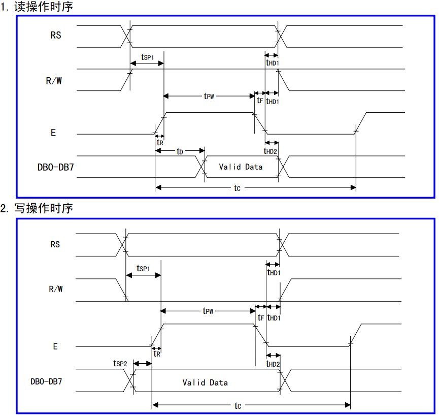
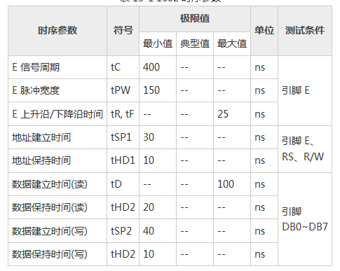

# 13.1 单片机通信时序解析

随着我们对通信技术的深入学习，大家要逐渐在头脑中建立起时序这种概念。所谓“时序”从字面意义上来理解，一是“时间问题”，二是“顺序问题”。

先说“顺序问题”，这个相对简单一些。我们在学 UART 串口通信的时候，先1位起始位，再8位数据位，最后1位停止位，这个先后顺序不能错。我们在学 1602 液晶的时候，比如写指令，RS=L，R/W=L，D0~D7=指令码，这三者的顺序是无所谓的，但是最终的 E=高脉冲，必须是在这三条程序之后，这个顺序一旦错误，写的数据也可会出错。

“时间问题”内容相对复杂。比如 UART 通信，每一位的时间宽度是 1/baud。我们初中就学过一个概念，世界上没有绝对的准确。那么每一位的时间宽度 1/baud 要求精确到什么范围内呢？

前边教程我提到过，单片机读取 UART 的 RXD 引脚数据的时候，一位数据，单片机平均分成了16份，取其中的7、8、9三次读到的结果，这三次中有2次是高电平那这一位就是1，有2次是低电平，那这一次就是0。如果我们的波特率稍微有些偏差，只要累计下来到最后一位停止位，这7、8、9还在范围内即可。如图13-1所示。 

图13-1 UART 信号采集时序图

我们用三个箭头来表示7、8、9这三次的采集位置，大家可以注意到，当采集到 D7 的时候，已经有一次采集偏出去了，但是我们采集到的数据还是不会错，因为有2次采集正确。至于这个偏差允许多大，大家自己可以详细算一下。实际上 UART 通信的波特率是允许一定范围内误差存在的，但是不能过大，否则就会采集错误。大家在计算波特率的时候，发现没有整除，有小数部分的时候，就要特别小心了，因为小数部分是一概被舍掉的，于是计算误差就产生了。我们用 11.0592 M 晶振计算的过程中，11059200/12/32/9600得到的是一个整数，如果用 12 M 晶振计算12000000/12/32/9600就会得到一个小数，大家可以算一下误差多少，是否在误差范围内。

1602 的时序问题，大家要学会通过 LCD1602 的数据手册提供的时序图和时序参数表格来进行研究，而且看懂时序图是学习单片机所必须掌握的一项技能，如图13-2所示。 

图13-2 1602 时序图

大家看到这种图的时候，不要感觉害怕。说句不过分的话，单片机这些逻辑上的问题，只要小学毕业就可以理解的，很多时候是因为大家把问题想象的太难才学不下去的。

我们先来看一下读操作时序的 RS 引脚和 R/W 引脚，这两个引脚先进行变化，因为是读操作，所以 R/W 引脚首先要置为高电平，而不管它原来是什么。读指令还是读数据，都是读操作，而且都有可能，所以 RS 引脚既有可能是置为高电平，也有可能是置为低电平，大家注意图上的画法。而 RS 和 R/W 变化了经过 Tsp1 这么长时间后，使能引脚 E 才能从低电平到高电平发生变化。

而使能引脚 E 拉高经过了 tD 这么长时间后，LCD1602 输出 DB 的数据就是有效数据了，我们就可以来读取 DB 的数据了。读完了之后，我们要先把使能 E 拉低，经过一段时间后 RS、R/W 和 DB 才可以变化继续为下一次读写做准备了。

而写操作时序和读操作时序的差别，就是写操作时序中，DB 的改变是由单片机来完成的，因此要放到使能引脚 E 的变化之前进行操作，其它区别大家可以自行对比一下。

细心的同学会发现，这个时序图上还有很多时间标签。比如 E 的上升时间 tR，下降时间时间 tF，使能引脚 E 从一个上升沿到下一个上升沿之间的长度周期 tC，使能 E 下降沿后，R/W 和 RS 变化时间间隔 tHD1 等等很多时间要求，这些要求怎么看呢？放心，只要是正规的数据手册，都会把这些时间要求给大家标记出来的。我们来看一下表13-1。

表 13-1 1602 时序参数 

大家要善于把手册中的这个表格和时序图结合起来看。表13-1中的数据，都是时序参数，本节课的所有时序参数，我都一点点的给大家讲出来，以后遇到同类时序图，就不再讲了，只是提一下，但是大家务必要学会自己看时序图，这个很重要，此外，看以下解释需要结合图13-2来看。

tC：指的是使能引脚 E 从本次上升沿到下次上升沿的最短时间是 400 ns，而我们单片机因为速度较慢，一个机器周期就是 1 us 多，而一条 C 语言指令肯定是一个或者几个机器周期的，所以这个条件完全满足。

tPW：指的是使能引脚 E 高电平的持续时间最短是 150 ns，同样由于我们的单片机比较慢，这个条件也完全满足。

tR, tF：指的是使能引脚 E 的上升沿时间和下降沿时间，不能超过 25 ns，别看这个数很小，其实这个时间限值是很宽裕的，我们实际用示波器测了一下开发板的这个引脚上升沿和下降沿时间大概是 10 ns 到 15 ns 之间，完全满足。

tSP1：指的是 RS 和 R/W 引脚使能后至少保持 30 ns，使能引脚 E 才可以变成高电平，这个条件同样也完全满足。

tHD1：指的是使能引脚 E 变成低电平后，至少保持 10 ns 之后，RS 和 R/W 才能进行变化，这个条件也完全满足。

tD：指的是使能引脚 E 变成高电平后，最多 100 ns 后，1602 就把数据送出来了，那么我们就可以正常去读取状态或者数据了。

tHD2：指的是读操作过程中，使能引脚 E 变成低电平后，至少保持 20 ns，DB 数据总线才可以进行变化，这个条件也完全满足。

tSP2：指的是 DB 数据总线准备好后，至少保持 40 ns，使能引脚 E 才可以从低到高进行使能变化，这个条件也完全满足。

tHD2：指的是写操作过程中，要引脚 E 变成低电平后，至少保持 10 ns，DB 数据总线才可以变化，这个条件也完全满足。

好了，表13-1这个 LCD1602 的时序参数表已经解析完成了，看完之后，是不是感觉比你想象的要简单，没有你想的那么困难。大家自己也得慢慢学会看这种时序图和表格，在今后的学习中，这方面的能力尤为重要。如果以后换用了其它型号的单片机，那么就根据单片机的执行速度来评估你的程序是否满足时序要求，整体上来说器件都是有一个最快速度的限制，而没有最慢限制，所以当换用高速的单片机后通常都是靠在各步骤间插入软件延时来满足较慢的时序要求。 