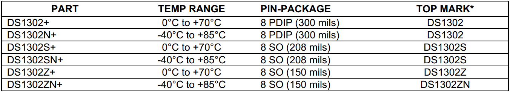
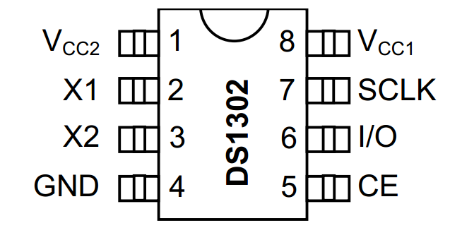
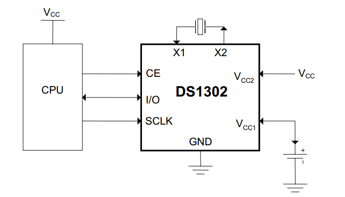
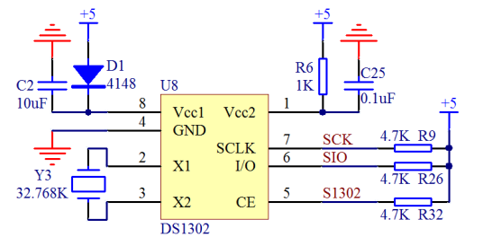
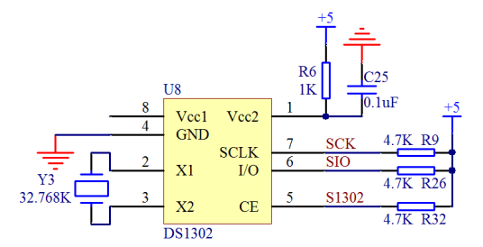
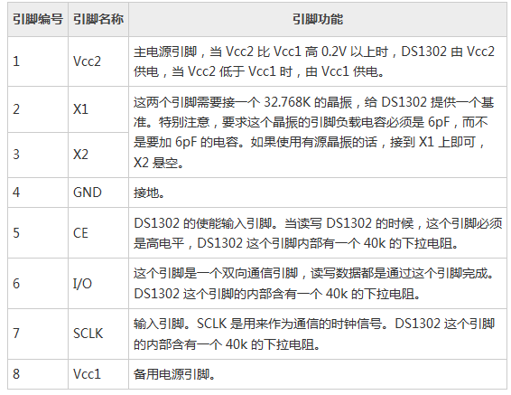

# 15.4 DS1302 的硬件信息

我们平时所用的不管是单片机，还是其它一些电子器件，根据使用条件的约束，可以分为商业级和工业级，主要是工作温度范围的不同，DS1302 的购买信息如下图15-4所示。 

图15-4 DS1302 订购信息

我们在订购 DS1302 的时候，就可以根据图15-4所标识的来跟销售厂家沟通，商业级的工作温度范围略窄，是0～70摄氏度，而工业级可以工作在零下40～85摄氏度。TOP MARK 就是指在芯片上印的字。

DS1302 一共有8个引脚，下边要根据引脚分布图和典型电路图来介绍一下每个引脚的功能，如图15-5和图15-6所示。 

图15-5 DS1302 引脚图

图15-6 DS1302典型电路

1脚 VCC2 是主电源正极的引脚，2脚 X1 和3脚 X2 是晶振输入和输出引脚，4脚 GND是负极，5脚 CE 是使能引脚，接单片机的 IO 口，6脚 I/O 是数据传输引脚，接单片机的 IO 口，7脚 SCLK 是通信时钟引脚，接单片机的 IO 口，8脚 VCC1 是备用电源引脚。考虑到 KST-51 开发板是一套以学习为目的的板子，加上备用电池对航空运输和携带不方便，所以8脚没有接备用电池，而是接了一个 10 uF 的电容，这个电容就相当于一个电量很小的电池，经过试验测量得出其可以在系统掉电后仍维持 DS1302 运行1分钟左右，如果大家想运行时间再长，可以加大电容的容量或者换成备用电池，如果掉电后不需要它再维持运行，也可以干脆悬空，如图15-7和图15-8所示。 

图15-7 DS1302 电容作备用电源

图15-8 DS1302无备用电源

涓流充电功能，基本也用不到，因为实际应用中很少会选择可充电电池作为备用电源，成本太高，本课程也不讲了，大家作为选学即可。我们使用的时候直接用 5 V 电源接一个二极管，在主电源上电的情况下给电容充电，在主电源掉电的情况下，二极管可以防止电容向主电路放电，而仅用来维持 DS1302 的供电，这种电路的最大用处是在电池供电系统中更换主电池的时候保持实时时钟的运行不中断，1分钟的时间对于更换电池足够了。此外，通过我们的使用经验，在 DS1302 的主电源引脚串联一个 1 K 电阻可以有效的防止电源对 DS1302 的冲击，R6 就是这个电阻，而 R9、R26、R32 都是上拉电阻。

我们把8个引脚功能分别介绍，如表15-1所示。

表15-1 DS1302 引脚功能图 

DS1302 电路的一个重点就是晶振电路，它所使用的晶振是一个 32.768 k 的晶振，晶振外部也不需要额外添加其它的电容或者电阻了。时钟的精度，首先取决于晶振的精度以及晶振的引脚负载电容。如果晶振不准或者负载电容过大或过小，都会导致时钟误差过大。在这一切都搞定后，最终一个考虑因素是晶振的温漂。随着温度的变化，晶振的精度也会发生变化，因此，在实际的系统中，其中一种方法就是经常校对。比如我们所用的电脑的时钟，通常我们会设置一个选项“将计算机设置与 internet 时间同步”。选中这个选项后，一般过一段时间，我们的计算机就会和 internet 时间校准同步一次。