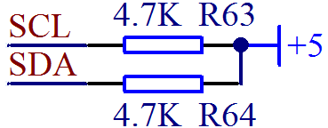

# 14.1 单片机 I2C 时序介绍

在硬件上，I2C 总线是由时钟总线 SCL 和数据总线 SDA 两条线构成，连接到总线上的所有器件的 SCL 都连到一起，所有 SDA 都连到一起。I2C 总线是开漏引脚并联的结构，因此我们外部要添加上拉电阻。对于开漏电路外部加上拉电阻，就组成了线“与”的关系。总线上线“与”的关系就是说，所有接入的器件保持高电平，这条线才是高电平，而任何一个器件输出一个低电平，那这条线就会保持低电平，因此可以做到任何一个器件都可以拉低电平，也就是任何一个器件都可以作为主机，如图14-1所示，我们添加了 R63 和 R64 两个上拉电阻。 

图14-1 I2C 总线的上拉电阻

虽然说任何一个设备都可以作为主机，但绝大多数情况下我们都是用单片机来做主机，而总线上挂的多个器件，每一个都像电话机一样有自己唯一的地址，在信息传输的过程中，通过这唯一的地址就可以正常识别到属于自己的信息，在 KST-51 开发板上，就挂接了2个 I2C 设备，一个是 24C02，一个是 PCF8591。

我们在学习 UART 串行通信的时候，知道了通信流程分为起始位、数据位、停止位这三部分，同理在 I2C 中也有起始信号、数据传输和停止信号，如图14-2所示。 

图14-2 I2C 时序流程图

从图上可以看出来，I2C 和 UART 时序流程有相似性，也有一定的区别。UART 每个字节中，都有一个起始位、8个数据位、1位停止位。而 I2C 分为起始信号、数据传输部分、停止信号。其中数据传输部分，可以一次通信过程传输很多个字节，字节数是不受限制的，而每个字节的数据最后也跟了一位，这一位叫做应答位，通常用 ACK 表示，有点类似于 UART 的停止位。

下面我们一部分一部分的把 I2C 通信时序进行剖析。之前我们已经学过了 UART，所以学习 I2C 的过程我尽量拿 UART 来作为对比，这样有助于更好的理解。但是有一点大家要理解清楚，就是 UART 通信虽然用了 TXD 和 RXD 两根线，但是实际一次通信中，1条线就可以完成，2条线是把发送和接收分开而已，而 I2C 每次通信，不管是发送还是接收，必须2条线都参与工作才能完成，为了更方便的看出来每一位的传输流程，我们把图14-2改进成图14-3。 

图14-3 I2C 通信流程解析

起始信号：UART 通信是从一直持续的高电平出现一个低电平标志起始位；而 I2C 通信的起始信号的定义是 SCL 为高电平期间，SDA 由高电平向低电平变化产生一个下降沿，表示起始信号，如图14-3中的 Start 部分所示。

数据传输：首先，UART 是低位在前，高位在后；而 I2C 通信是高位在前，低位在后。其次，UART 通信数据位是固定长度，波特率分之一，一位一位固定时间发送完毕就可以了。而 I2C 没有固定波特率，但是有时序的要求，要求当 SCL 在低电平的时候，SDA 允许变化，也就是说，发送方必须先保持 SCL 是低电平，才可以改变数据线 SDA，输出要发送的当前数据的一位；而当 SCL 在高电平的时候，SDA 绝对不可以变化，因为这个时候，接收方要来读取当前 SDA 的电平信号是0还是1，因此要保证 SDA 的稳定，如图14-3中的每一位数据的变化，都是在 SCL 的低电平位置。8位数据位后边跟着的是一位应答位，应答位我们后边还要具体介绍。

停止信号：UART 通信的停止位是一位固定的高电平信号；而 I2C 通信停止信号的定义是 SCL 为高电平期间，SDA 由低电平向高电平变化产生一个上升沿，表示结束信号，如图14-3中的 Stop 部分所示。 