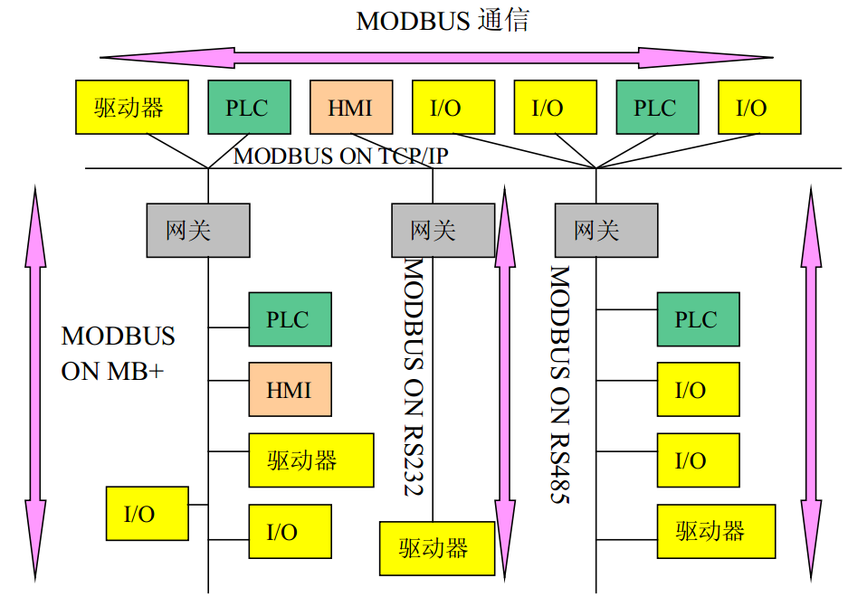
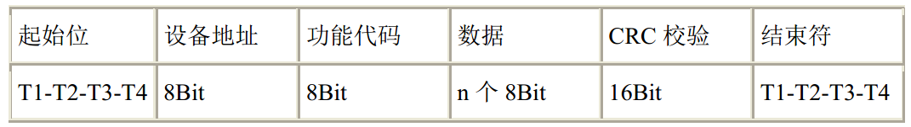
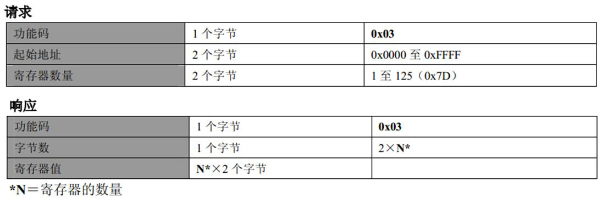

# 18.2 Modbus 通信协议介绍

我们前边学习 UART、I2C、SPI 这些通信协议，都是最底层的协议，是“位”级别的协议。而我们在学习13章做实用串口通信程序的时候，我们通过串口发给单片机三条指令，让单片机做了三件不同的事情，分别是“buzz on”、“buzz off”和“showstr”。随着系统复杂性的增加，我们希望可以实现更多的指令。而指令越来越多，带来的后果就是非常杂乱无章，尤其是这个人喜欢写成“buzz on”、“buzz off”，而另外一个人喜欢写成“on buzz”、“off buzz”。导致不同开发人员写出来的程序代码不兼容，不同厂家的产品不能挂到一条总线上通信。

随着这种矛盾的日益严重，就会有聪明人提出更合理的解决方案，提出一些标准来，今后我们的编程必须按照这个标准来，这种标准也是一种通信协议，但是和 UART、I2C、SPI通信协议不同的是，这种通信协议是字节级别的，叫做应用层通信协议。在1979年由 Modicon（现为施耐德电气公司的一个品牌）提出了全球第一个真正用于工业现场总线的协议，就是 Modbus 协议。 

## Modbus 协议特点

Modbus 协议是应用于电子控制器上的一种通用语言。通过此协议，控制器相互之间、控制器经由网络（例如以太网）和其他设备之间可以通信，已经成为一种工业标准。有了它，不同厂商生产的控制设备可以连成工业网络，进行集中监控。这种协议定义了一种控制器能够认识使用的数据结构，而不管它们是经过何种网络进行通信的。它描述了控制器请求访问其它设备的过程，如何回应来自其它设备的请求，以及怎样侦测错误记录，它制定了通信数据的格局和内容的公共格式。

在进行多机通信的时候，Modbus 协议规定每个控制器必须要知道它们的设备地址，识别按照地址发送过来的数据，决定是否要产生动作，产生何种动作，如果要回应，控制器将生成的反馈信息用 Modbus 协议发出。

Modbus 协议允许在各种网络体系结构内进行简单通信，每种设备（PLC、人机界面、控制面板、驱动程序、输入输出设备等）都能使用 Modbus 协议来启动远程操作，一些网关允许在几种使用 Modbus 协议的总线或网络之间的通信，如图18-4所示。 

图18-4 Modbus 网络体系结构实例

Modbus 协议的整体架构和格式比较复杂和庞大，在我们的课程里，我们重点介绍数据帧结构和数据通信控制方式，作为一个入门级别的了解。如果大家要详细了解，或者使用 Modbus 开发相关设备，可以查阅相关的国标文件再进行深入学习。
 
## RTU 协议帧数据

Modbus 有两种通信传输方式，一种是 ASCII 模式，一种是 RTU 模式。由于 ASCII 模式的数据字节是 7bit 数据位，51单片机无法实现，而且实际应用的也比较少，所以这里我们只用 RTU 模式。两种模式相似，会用一种另外一种也就会了。一条典型的 RTU 数据帧如图18-5所示。 

图18-5 RTU 数据帧

与之前我们讲解实用串口通信程序时用的原理相同，一次发送的数据帧必须是作为一个连续的数据流进行传输。我们在实用串口通信程序中采用的方法是定义 30 ms，如果数据接收时超过了 30 ms 还没有接收到下一个字节，我们就认为这次的数据结束。而 Modbus 的 RTU 模式规定不同数据帧之间的间隔是3.5个字节通信时间以上。如果在一帧数据完成之前有超过3.5个字节时间的停顿，接收设备将刷新当前的消息并假定下一个字节是一个新的数据帧的开始。同样的，如果一个新消息在小于3.5个字节时间内接着前边一个数据开始，接收设备将会认为它是前一帧数据的延续。这将会导致一个错误，因此大家看 RTU 数据帧最后还有 16bit 的 CRC 校验。

起始位和结束符：图18-5上代表的是一个数据帧，前后都至少有3.5个字节的时间间隔，起始位和结束符实际上没有任何数据，T1-T2-T3-T4 代表的是时间间隔3.5个字节以上的时间，而真正有意义的第一个字节是设备地址。

设备地址：很多同学不理解，在多机通信的时候，数据那么多，我们依靠什么判断这个数据帧是哪个设备的呢？没错，就是依靠这个设备地址字节。每个设备都有一个自己的地址，当设备接收到一帧数据后，程序首先对设备地址字节进行判断比较，如果与自己的地址不同，则对这帧数据直接不予理会，如果与自己的地址相同，就要对这帧数据进行解析，按照之后的功能码执行相应的功能。如果地址是 0x00，则认为是一个广播命令，就是所有的从机设备都要执行的指令。

功能代码：在第二个字节功能代码字节中，Modbus 规定了部分功能代码，此外也保留了一部分功能代码作为备用或者用户自定义，这些功能码大家不需要去记忆，甚至都不用去看，直到你用到的那天再过来查这个表格即可，如表18-1所示。

<table>
	<caption>
		表 18-1 Modbus 功能码</caption>
	<tbody>
		<tr>
			<th>
				功能码</th>
			<th>
				名称</th>
			<th>
				作用</th>
		</tr>
		<tr>
			<td>
				01</td>
			<td>
				读取线圈状态</td>
			<td>
				取得一组逻辑线圈的当前状态(ON/OFF)</td>
		</tr>
		<tr>
			<td>
				02</td>
			<td>
				读取输入状态</td>
			<td>
				取得一组开关输入的当前状态(ON/OFF)</td>
		</tr>
		<tr>
			<td>
				03</td>
			<td>
				读取保持寄存器</td>
			<td>
				在一个或多个保持寄存器中取得当前的二进制值</td>
		</tr>
		<tr>
			<td>
				04</td>
			<td>
				读取输入寄存器</td>
			<td>
				在一个或多个输入寄存器中取得当前的二进制值</td>
		</tr>
		<tr>
			<td>
				05</td>
			<td>
				强置单线圈</td>
			<td>
				强置一个逻辑线圈的通断状态</td>
		</tr>
		<tr>
			<td>
				06</td>
			<td>
				预置单寄存器</td>
			<td>
				把具体二进值装入一个保持寄存器</td>
		</tr>
		<tr>
			<td>
				07</td>
			<td>
				读取异常状态</td>
			<td>
				取得&nbsp;8&nbsp;个内部线圈的通断状态，这&nbsp;8&nbsp;个线圈的地址由 
				控制器决定，用户逻辑可以将这些线圈定义，以说明 
				从机状态，短报文适宜于迅速读取状态</td>
		</tr>
		<tr>
			<td>
				08</td>
			<td>
				回送诊断校验</td>
			<td>
				把诊断校验报文送从机，以对通信处理进行评鉴</td>
		</tr>
		<tr>
			<td>
				09</td>
			<td>
				编程(只用于&nbsp;484)</td>
			<td>
				使主机模拟编程器作用，修改&nbsp;PC&nbsp;从机逻辑</td>
		</tr>
		<tr>
			<td>
				10</td>
			<td>
				控询(只用于&nbsp;484)</td>
			<td>
				可使主机与一台正在执行长程序任务从机通信，探询 
				该从机是否已完成其操作任务，仅在含有功能码&nbsp;9 
				的报文发送后，本功能码才发送</td>
		</tr>
		<tr>
			<td>
				11</td>
			<td>
				读取事件计数</td>
			<td>
				可使主机发出单询问，并随即判定操作是否成功，尤 
				其是该命令或其它应答产生通信错误时</td>
		</tr>
		<tr>
			<td>
				12</td>
			<td>
				读取通信事件记录</td>
			<td>
				可使主机检索每台从机的&nbsp;ModBus&nbsp;事务处理通信事件 
				记录。如果某项事务处理完成，记录会给出有关错误</td>
		</tr>
		<tr>
			<td>
				13</td>
			<td>
				编程(184/384&nbsp;484&nbsp;584&nbsp;)</td>
			<td>
				可使主机模拟编程器功能修改&nbsp;PC&nbsp;从机逻辑</td>
		</tr>
		<tr>
			<td>
				14</td>
			<td>
				探询(184/384&nbsp;484&nbsp;584)</td>
			<td>
				可使主机与正在执行任务的从机通信，定期控询该从 
				机是否已完成其程序操作，仅在含有功能&nbsp;13&nbsp;的报文 
				发送后，本功能码才得发送</td>
		</tr>
		<tr>
			<td>
				15</td>
			<td>
				强置多线圈</td>
			<td>
				强置一串连续逻辑线圈的通断</td>
		</tr>
		<tr>
			<td>
				16</td>
			<td>
				预置多寄存器</td>
			<td>
				把具体的二进制值装入一串连续的保持寄存器</td>
		</tr>
		<tr>
			<td>
				17</td>
			<td>
				报告从机标识</td>
			<td>
				可使主机判断编址从机的类型及该从机运行指示灯 
				的状态</td>
		</tr>
		<tr>
			<td>
				18</td>
			<td>
				884&nbsp;和&nbsp;MICRO&nbsp;84</td>
			<td>
				可使主机模拟编程功能，修改&nbsp;PC&nbsp;状态逻辑</td>
		</tr>
		<tr>
			<td>
				19</td>
			<td>
				重置通信链路</td>
			<td>
				发生非可修改错误后，是从机复位于已知状态，可重 
				置顺序字节</td>
		</tr>
		<tr>
			<td>
				20</td>
			<td>
				读取通用参数(584L)</td>
			<td>
				显示扩展存储器文件中的数据信息</td>
		</tr>
		<tr>
			<td>
				21</td>
			<td>
				写入通用参数(584L)</td>
			<td>
				把通用参数写入扩展存储文件，或修改</td>
		</tr>
		<tr>
			<td>
				22~64</td>
			<td>
				保留作扩展功能备用</td>
			<td>
				&nbsp;</td>
		</tr>
		<tr>
			<td>
				65~72</td>
			<td>
				保留以备用户功能所用</td>
			<td>
				留作用户功能的扩展编码</td>
		</tr>
		<tr>
			<td>
				73~119</td>
			<td>
				非法功能</td>
			<td>
				&nbsp;</td>
		</tr>
		<tr>
			<td>
				120~127</td>
			<td>
				保留</td>
			<td>
				留作内部作用</td>
		</tr>
		<tr>
			<td>
				128~255</td>
			<td>
				保留</td>
			<td>
				用于异常应答</td>
		</tr>
	</tbody>
</table>

程序对功能码的处理，就是来检测这个字节的数值，然后根据其数值来做相应的功能处理。

数据：跟在功能代码后边的是 n 个 8bit 的数据。这个 n 值的到底是多少，是功能代码来确定的，不同的功能代码后边跟的数据数量不同。举个例子，如果功能码是 0x03，也就是读保持寄存器，那么主机发送数据 n 的组成部分就是：2个字节的寄存器起始地址，加2个字节的寄存器数量 N。从机数据 n 的组成部分是：1个字节的字节数，因为我们回复的寄存器的值是2个字节，所以这个字节数也就是 2N 个，再加上 2N 个寄存器的值，如图18-6所示。

图18-6 读保持寄存器数据结构

CRC 校验：CRC 校验是一种数据算法，是用来校验数据对错的。CRC 校验函数把一帧数据除最后两个字节外，前边所有的字节进行特定的算法计算，计算完后生成了一个 16bit 的数据，作为 CRC 校验码，添加在一帧数据的最后。接收方接收到数据后，同样会把前边的字节进行 CRC 计算，计算完了再和发过来的 16bit 的 CRC 数据进行比较，如果相同则认为数据正常，没有出错，如果比较不相同，则说明数据在传输中发生了错误，这帧数据将被丢弃，就像没收到一样，而发送方会在得不到回应后做相应的处理错误处理。

RTU 模式的每个字节的位是这样分布的：1个起始位、8个数据位，最小有效位先发送、1个奇偶校验位（如果无校验则没有这一位）、1位停止位（有校验位时）或者2个停止位（无校验位时）。