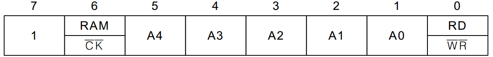
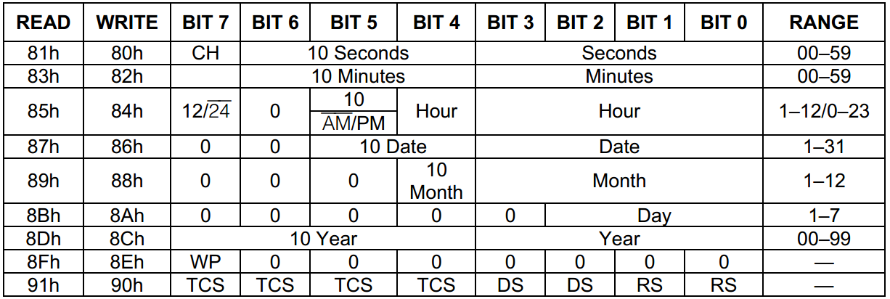

# 15.5 DS1302 寄存器介绍

DS1302 的一条指令一个字节共8位，其中第7位（即最高位）固定为1，这一位如果是0的话，那写进去也是无效的。第6位是选择 RAM 还是 CLOCK 的，我前边说过，我们这里主要讲 CLOCK 时钟的使用，它的 RAM 功能我们不用，所以如果选择 CLOCK 功能，第6位是0，如果要用 RAM，那第6位就是1。从第5到第1位，决定了寄存器的5位地址，而第0位是读写位，如果要写，这一位就是0，如果要读，这一位就是1。指令字节直观位分配如图15-9所示。 

图15-9 DS1302 命令字节

DS1302 时钟的寄存器，其中8个和时钟有关的，5位地址分别是 0b00000～0b00111，还有一个寄存器的地址是 01000，这是涓流充电所用的寄存器，我们这里不讲。在 DS1302 的数据手册里的地址，直接把第7位、第6位和第0位值给出来了，所以指令就成了 0x80、0x81 那些了，最低位是1，那么表示读，最低位是0表示写，如图15-10所示。 

图15-10  DS1302 的时钟寄存器

寄存器0：最高位 CH 是一个时钟停止标志位。如果时钟电路有备用电源，上电后，我们要先检测一下这一位，如果这一位是0，那说明时钟芯片在系统掉电后，由于备用电源的供给，时钟是持续正常运行的；如果这一位是1，那么说明时钟芯片在系统掉电后，时钟部分不工作了。如果 Vcc1 悬空或者是电池没电了，当我们下次重新上电时，读取这一位，那这一位就是1，我们可以通过这一位判断时钟在单片机系统掉电后是否还正常运行。剩下的7位高3位是秒的十位，低4位是秒的个位，这里再提请注意一次，DS1302 内部是 BCD 码，而秒的十位最大是5，所以3个二进制位就够了。

寄存器1：最高位未使用，剩下的7位中高3位是分钟的十位，低4位是分钟的个位。

寄存器2：bit7 是1的话代表是12小时制，0代表是24小时制；bit6 固定是0，bit5 在12小时制下 0代表的是上午，1代表的是下午，在24小时制下和 bit4 一起代表了小时的十位，低4位代表的是小时的个位。

寄存器3：高2位固定是0，bit5 和 bit4 是日期的十位，低4位是日期的个位。

寄存器4：高3位固定是0，bit4 是月的十位，低4位是月的个位。

寄存器5：高5位固定是0，低3位代表了星期。

寄存器6：高4位代表了年的十位，低4位代表了年的个位。请特别注意，这里的00～99指的是2000年～2099年。

寄存器7：最高位一个写保护位，如果这一位是1，那么是禁止给任何其它寄存器或者那31个字节的 RAM 写数据的。因此在写数据之前，这一位必须先写成0。 