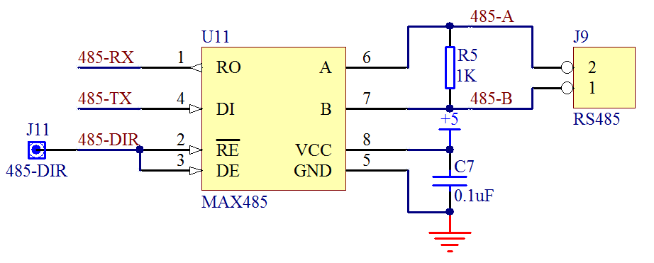

# 18.1 单片机 RS485 通信接口、控制线、原理图及程序实例

RS232 标准是诞生于 RS485 之前的，但是 RS232 有几处不足的地方： 
1. 接口的信号电平值较高，达到十几 V，使用不当容易损坏接口芯片，电平标准也与 TTL 电平不兼容。
2. 传输速率有局限，不可以过高，一般到一两百千比特每秒(Kb/s)就到极限了。
3. 接口使用信号线和 GND 与其它设备形成共地模式的通信，这种共地模式传输容易产生干扰，并且抗干扰性能也比较弱。
4. 传输距离有限，最多只能通信几十米。
5. 通信的时候只能两点之间进行通信，不能够实现多机联网通信。

针对 RS232 接口的不足，就不断出现了一些新的接口标准，RS485 就是其中之一，它具备以下的特点： 
1. 采用差分信号。我们在讲 A/D 的时候，讲过差分信号输入的概念，同时也介绍了差分输入的好处，最大的优势是可以抑制共模干扰。尤其当工业现场环境比较复杂，干扰比较多时，采用差分方式可以有效的提高通信可靠性。RS485 采用两根通信线，通常用 A 和 B 或者 D+ 和 D- 来表示。逻辑“1”以两线之间的电压差为 +(0.2~6)V 表示，逻辑“0”以两线间的电压差为 -(0.2~6)V 来表示，是一种典型的差分通信。
2. RS485 通信速率快，最大传输速度可以达到 10 Mb/s 以上。
3. RS485 内部的物理结构，采用的是平衡驱动器和差分接收器的组合，抗干扰能力也大大增加。
4. 传输距离最远可以达到1200米左右，但是它的传输速率和传输距离是成反比的，只有在 100 Kb/s 以下的传输速度，才能达到最大的通信距离，如果需要传输更远距离可以使用中继。
5. 可以在总线上进行联网实现多机通信，总线上允许挂多个收发器，从现有的 RS485 芯片来看，有可以挂32、64、128、256等不同个设备的驱动器。
6. RS485 的接口非常简单，与 RS232 所使用的 MAX232 是类似的，只需要一个 RS485 转换器，就可以直接与单片机的 UART 串口连接起来，并且使用完全相同的异步串行通信协议。但是由于 RS485 是差分通信，因此接收数据和发送数据是不能同时进行的，也就是说它是一种半双工通信。那我们如何判断什么时候发送，什么时候接收呢？

RS485 转换芯片很多，这节课我们以典型的 MAX485 为例讲解 RS485 通信，如图18-1所示。 



图18-1 MAX485 硬件接口

MAX485 是美信(Maxim)推出的一款常用 RS485 转换器。其中5脚和8脚是电源引脚；6脚和7脚就是 RS485 通信中的 A 和 B 两个引脚；1脚和4脚分别接到单片机的 RXD 和 TXD 引脚上，直接使用单片机 UART 进行数据接收和发送；2脚和3脚是方向引脚，其中2脚是低电平使能接收器，3脚是高电平使能输出驱动器，我们把这两个引脚连到一起，平时不发送数据的时候，保持这两个引脚是低电平，让 MAX485 处于接收状态，当需要发送数据的时候，把这个引脚拉高，发送数据，发送完毕后再拉低这个引脚就可以了。为了提高 RS485 的抗干扰能力，需要在靠近 MAX485 的 A 和 B 引脚之间并接一个电阻，这个电阻阻值从100欧到 1 K 都是可以。

在这里我们还要介绍一下如何使用 KST-51 单片机开发板进行外围扩展实验。我们的开发板只能把基本的功能给同学们做出来提供实验练习，但是同学们学习的脚步不应该停留在这个实验板上。如果想进行更多的实验，就可以通过单片机开发板的扩展接口进行扩展实验。大家可以看到蓝绿色的单片机座周围有32个插针，这32个插针就是把单片机的32个 IO 引脚全部都引出来了。在原理图上体现出来的就是 J4、J5、J6、J7 这4个器件，如图18-2所示。 


图18-2 单片机扩展接口

这32个 IO 口中并不是所有的都可以用来对外扩展，其中既作为数据输出，又可以作为数据输入的引脚是不可以用的，比如 P3.2、P3.4、P3.6 引脚，这三个引脚是不可用的。比如 P3.2 这个引脚，如果我们用来扩展，发送的信号如果和 DS18B20 的时序吻合，会导致 DS18B20 拉低引脚，影响通信。除这3个 IO 口以外的其它29个，都可以使用杜邦线接上插针，扩展出来使用。当然了，如果把当前的 IO 口应用于扩展功能了，板子上的相应功能就实现不了了，也就是说需要扩展功能和板载功能之间二选一。

在进行 RS485 实验中，我们通信用的引脚必须是 P3.0 和 P3.1，此外还有一个方向控制引脚，我们使用杜邦线将其连接到 P1.7 上去。RS485 的另外一端，大家可以使用一个 USB 转 RS485 模块，用双绞线把开发板和模块上的 A 和 B 分别对应连起来，USB 那头插入电脑，然后就可以进行通信了。

学习了第13章实用的串口通信方法和程序后，做这种串口通信的方法就很简单了，基本是一致的。我们使用实用串口通信例程的思路，做了一个简单的程序，通过串口调试助手下发任意个字符，单片机接收到后在末尾添加“回车+换行”符后再送回，在调试助手上重新显示出来，先把程序贴出来。

程序中需要注意的一点是：因为平常都是将 MAX485 设置为接收状态，只有在发送数据的时候才将 MAX485 改为发送状态，所以在 UartWrite()函数开头将 MAX485 方向引脚拉高，函数退出前再拉低。但是这里有一个细节，就是单片机的发送和接收中断产生的时刻都是在停止位的一半上，也就是说每当停止位传送了一半的时候，RI 或 TI 就已经置位并且马上进入中断（如果中断使能的话）函数了，接收的时候自然不会存在问题，但发送的时候就不一样了：当紧接着向 SBUF 写入一个字节数据时，UART 硬件会在完成上一个停止位的发送后，再开始新字节的发送，但如果此时不是继续发送下一个字节，而是已经发送完毕了，要停止发送并将 MAX485 方向引脚拉低以使 MAX485 重新处于接收状态时就有问题了，因为这时候最后的这个停止位实际只发送了一半，还没有完全完成，所以就有了 UartWrite()函数内 DelayX10us(5)这个操作，这是人为的增加了 50 us 的延时，这 50 us 的时间正好让剩下的一半停止位完成，那么这个时间自然就是由通信波特率决定的了，为波特率周期的一半。
/****************************RS485.c 文件程序源代码*****************************/ 

```
#include <reg52.h>
#include <intrins.h>

sbit RS485_DIR = P1^7; //RS485 方向选择引脚
bit flagFrame = 0; //帧接收完成标志，即接收到一帧新数据
bit flagTxd = 0; //单字节发送完成标志，用来替代 TXD 中断标志位
unsigned char cntRxd = 0; //接收字节计数器
unsigned char pdata bufRxd[64]; //接收字节缓冲区

extern void UartAction(unsigned char *buf, unsigned char len);

/* 串口配置函数，baud-通信波特率 */
void ConfigUART(unsigned int baud){
    RS485_DIR = 0; //RS485 设置为接收方向
    SCON = 0x50; //配置串口为模式 1
    TMOD &= 0x0F; //清零 T1 的控制位
    TMOD |= 0x20; //配置 T1 为模式 2
    TH1 = 256 - (11059200/12/32)/baud; //计算 T1 重载值
    TL1 = TH1; //初值等于重载值
    ET1 = 0; //禁止 T1 中断
    ES = 1; //使能串口中断
    TR1 = 1; //启动 T1
}
/* 软件延时函数，延时时间(t*10)us */
void DelayX10us(unsigned char t){
    do {
        _nop_();
        _nop_();
        _nop_();
        _nop_();
        _nop_();
        _nop_();
        _nop_();
        _nop_();
    } while (--t);
}
/* 串口数据写入，即串口发送函数，buf-待发送数据的指针，len-指定的发送长度 */
void UartWrite(unsigned char *buf, unsigned char len){
    RS485_DIR = 1; //RS485 设置为发送
   
    while (len--){ //循环发送所有字节
        flagTxd = 0; //清零发送标志
        SBUF = *buf++; //发送一个字节数据
        while (!flagTxd); //等待该字节发送完成
    }
    DelayX10us(5); //等待最后的停止位完成，延时时间由波特率决定
    RS485_DIR = 0; //RS485 设置为接收
}
/* 串口数据读取函数，buf-接收指针，len-指定的读取长度，返回值-实际读到的长度 */
unsigned char UartRead(unsigned char *buf, unsigned char len){
    unsigned char i;
    //指定读取长度大于实际接收到的数据长度时，
    //读取长度设置为实际接收到的数据长度
    if (len > cntRxd){
        len = cntRxd;
    }
    for (i=0; i<len; i++){ //拷贝接收到的数据到接收指针上
        *buf++ = bufRxd[i];
    }
    cntRxd = 0; //接收计数器清零
    return len; //返回实际读取长度
}
/* 串口接收监控，由空闲时间判定帧结束，需在定时中断中调用，ms-定时间隔 */
void UartRxMonitor(unsigned char ms){
    static unsigned char cntbkp = 0;
    static unsigned char idletmr = 0;
   
    if (cntRxd > 0){ //接收计数器大于零时，监控总线空闲时间
        if (cntbkp != cntRxd){ //接收计数器改变，即刚接收到数据时，清零空闲计时
            cntbkp = cntRxd;
            idletmr = 0;
        }else{ //接收计数器未改变，即总线空闲时，累积空闲时间
            if (idletmr < 30){ //空闲计时小于 30ms 时，持续累加
                idletmr += ms;
                if (idletmr >= 30){ //空闲时间达到 30ms 时，即判定为一帧接收完毕
                    flagFrame = 1; //设置帧接收完成标志
                }
            }
        }
    }else{
        cntbkp = 0;
    }
}
/* 串口驱动函数，监测数据帧的接收，调度功能函数，需在主循环中调用 */
void UartDriver(){
    unsigned char len;
    unsigned char pdata buf[40];
   
    if (flagFrame){ //有命令到达时，读取处理该命令
        flagFrame = 0;
        len = UartRead(buf, sizeof(buf)-2); //将接收到的命令读取到缓冲区中
        UartAction(buf, len); //传递数据帧，调用动作执行函数
    }
}
/* 串口中断服务函数 */
void InterruptUART() interrupt 4{
    if (RI){ //接收到新字节
        RI = 0; //清零接收中断标志位
        //接收缓冲区尚未用完时，保存接收字节，并递增计数器
        if (cntRxd < sizeof(bufRxd)){
            bufRxd[cntRxd++] = SBUF;
        }
    }
    if (TI){ //字节发送完毕
        TI = 0; //清零发送中断标志位
        flagTxd = 1; //设置字节发送完成标志
    }
}
```

/*****************************main.c 文件程序源代码******************************/ 

```
#include <reg52.h>

unsigned char T0RH = 0; //T0 重载值的高字节
unsigned char T0RL = 0; //T0 重载值的低字节

void ConfigTimer0(unsigned int ms);
extern void UartDriver();
extern void ConfigUART(unsigned int baud);
extern void UartRxMonitor(unsigned char ms);
extern void UartWrite(unsigned char *buf, unsigned char len);

void main(){
    EA = 1; //开总中断
    ConfigTimer0(1); //配置 T0 定时 1ms
    ConfigUART(9600); //配置波特率为 9600

    while (1){
        UartDriver(); //调用串口驱动
    }
}
/* 串口动作函数，根据接收到的命令帧执行响应的动作
buf-接收到的命令帧指针，len-命令帧长度 */
void UartAction(unsigned char *buf, unsigned char len){
    //在接收到的数据帧后添加换车换行符后发回
    buf[len++] = '\r';
    buf[len++] = '\n';
    UartWrite(buf, len);
}
/* 配置并启动 T0，ms-T0 定时时间 */
void ConfigTimer0(unsigned int ms){
    unsigned long tmp; //临时变量
    tmp = 11059200 / 12; //定时器计数频率
    tmp = (tmp * ms) / 1000; //计算所需的计数值
    tmp = 65536 - tmp; //计算定时器重载值
    tmp = tmp + 33; //补偿中断响应延时造成的误差
    T0RH = (unsigned char)(tmp>>8); //定时器重载值拆分为高低字节
    T0RL = (unsigned char)tmp;
    TMOD &= 0xF0; //清零 T0 的控制位
    TMOD |= 0x01; //配置 T0 为模式 1
    TH0 = T0RH; //加载 T0 重载值
    TL0 = T0RL;
    ET0 = 1; //使能 T0 中断
    TR0 = 1; //启动 T0
}
/* T0 中断服务函数，执行串口接收监控 */
void InterruptTimer0() interrupt 1{
    TH0 = T0RH; //重新加载重载值
    TL0 = T0RL;
    UartRxMonitor(1); //串口接收监控
}
```

现在看这种串口程序，是不是感觉很简单了呢？串口通信程序我们反反复复的使用，加上随着学习的模块越来越多，实践的越来越多，原先感觉很复杂的东西，现在就会感到简单了。从设备管理器里可以查看所有的 COM 口号，我们下载程序用的是 COM4，而 USB 转 RS485 虚拟的是 COM5，通信的时候我们用的是 COM5 口，如图18-3所示。 


图18-3 RS485 通信试验设置和结果